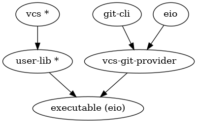
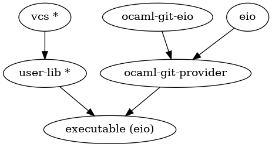

# vcs

[](https://github.com/mbarbin/vcs/actions/workflows/ci.yml)
[](https://coveralls.io/github/mbarbin/vcs?branch=main)

A versatile OCaml library for Git interaction

## Overview

`Vcs` is an OCaml library providing a direct-style API for interacting with Git repositories. It's designed as an "interface", or "virtual" library with the actual implementation dynamically dispatched at runtime. This design allows for high flexibility and adaptability to different use cases.

## Architecture

The `vcs` repository contains several components:



- **vcs**: The main entry point of the library. Marked with a * to indicate no
  runtime dependencies.
- **user-lib**: A placeholder in the diagram for any library that uses `Vcs`.
  Also marked with a * to indicate no runtime dependencies.
- **executable**: A placeholder for a runtime component based on `user-lib` that
  commits to a specific provider and concurrency model.
- **git-cli**: A IO-free library that parses the output of a `git` cli process.
- **vcs-git**: An instantiation of `Git_cli` based on an `Eio` runtime.
- **vcs-git-blocking**: An instantiation of `Git_cli` based on the OCaml `Stdlib`.


## Design principles

`Vcs` is designed to be backend-agnostic and concurrency-runtime independent. It's compatible with both `Eio` and OCaml `Stdlib` runtimes. We plan to explore the feasibility of supporting [luv](https://github.com/aantron/luv) and [miou](https://github.com/robur-coop/miou) runtimes as separate future work.

The concurrency runtime must be compatible with programs written in a direct style. Runtime based on monadic concurrent models such as `Async` and `Lwt` are purposely left outside of the scope of this project.

## How It Works

`Vcs` is an interface composed of [Traits](doc/traits.md), each providing different functionalities associated with Git interaction. The dynamic dispatch implementation of Vcs is powered by the [provider](https://github.com/mbarbin/provider) library.

## Motivation

Our goal is to create a versatile and highly compatible library that can cater to a wide range of use cases, while also fostering community engagement. We also hope to gain practical experience with the use of provider-based parametric libraries.

## Relation to ocaml-git

[ocaml-git](https://github.com/mirage/ocaml-git) is a pure OCaml implementation of the Git format and protocol. In the `Vcs` framework, an Eio compatible `ocaml-git` is a potential `provider` for the interface. We plan to create a `Vcs` provider based on `ocaml-git` in the future.



## Acknowledgements

We extend our gratitude to the following individuals and teams, whose contributions have been great sources of inspiration for the `Vcs` project:

- The `Eio` developers for their work on the [Eio](https://github.com/ocaml-multicore/eio) project. The development of `Eio` has sparked a great deal of enthusiasm for us in our work on the `Vcs` project. We've also referred to Eio's [Exn](https://ocaml-multicore.github.io/eio/eio/Eio/Exn/index.html) module in the design of `Vcs`'s error handling.

- The Jane Street developers for their significant contributions to the open source community. In particular, this project has drawn inspiration from the `Mercurial` backend of `Iron`, Jane Street's code review tool. For more details about how `Iron` has influenced this project and the licensing implications, please refer to the `NOTICE.md` file.

- Vincent Simonet and contributors for [headache](https://github.com/Frama-C/headache), which we use to manage the copyright headers at the beginning of our files.

- The [Rresult](https://erratique.ch/software/rresult/doc/Rresult/index.html#usage) developers: Their usage design guidelines have been a reference in the design of `Vcs`'s error handling, the `Vcs.Result` module in particular.

We look forward to continuing to learn from and collaborate with the broader open source community.

## Code documentation

The code documentation of the latest release is built with `odoc` and published to `GitHub` pages [here](https://mbarbin.github.io/vcs).

## Examples

Explore the [example](example/) directory to get a firsthand look at how Vcs works in practice.

## Build

This repository depends on unreleased packages found in a custom [opam-repository](https://github.com/mbarbin/opam-repository.git). You'll need to add this to your opam switch when building the project.

For example, if you use a local opam switch, this would look like this:

```sh
git clone https://github.com/mbarbin/vcs.git
cd vcs
opam switch create . 5.2.0 --no-install
eval $(opam env)
opam repo add mbarbin https://github.com/mbarbin/opam-repository.git
opam install . --deps-only --with-test --with-doc
```

Once this is setup, you can build with dune:

```sh
dune build @all @runtest
```

## Current Status

We're currently seeking feedback as we write and publish the code and its dependencies to the opam repository. Please do not hesitate to open issues on GitHub with general feedback, requests, or simply start a discussion.
