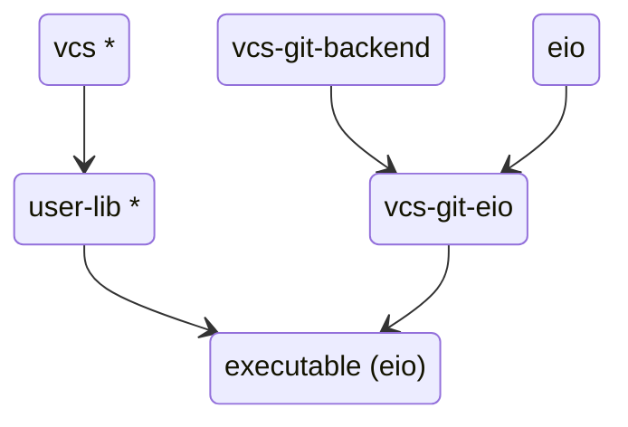
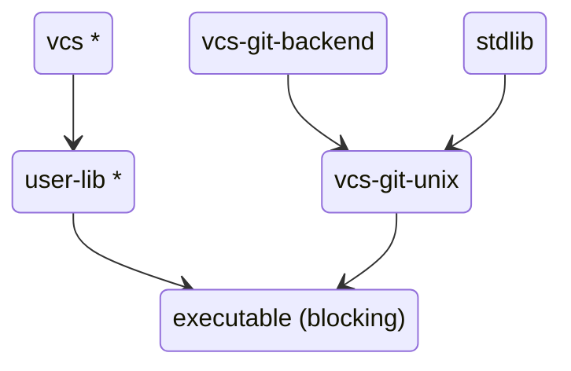
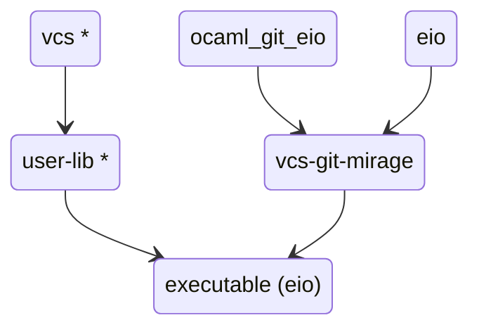

# Explanation

Welcome to the Explanation section of the `vcs` documentation. Here, we delve into the details of how `vcs` works, its design principles, and our future plans. This section is intended to provide a deeper understanding of the project for developers and contributors.

## Design principles

`Vcs` is designed to be backend-agnostic and concurrency-runtime independent. It's compatible with both `Eio` and OCaml `Stdlib` runtimes. We plan to explore the feasibility of supporting [luv](https://github.com/aantron/luv) and [miou](https://github.com/robur-coop/miou) runtimes as separate future work.

The concurrency runtime must be compatible with programs written in a direct style. Runtime based on monadic concurrent models such as `Async` and `Lwt` are purposely left outside of the scope of this project.

## How It Works

`Vcs` is an interface composed of [Traits](./traits.md), each providing different functionalities associated with Git operations. The dynamic dispatch implementation of Vcs is powered by the use of OCaml Objects under the hood, with some design guidelines aimed at making it so that users do not need to make much direct use of objects in their code.

## Architecture

The `vcs` repository contains several components:

- **vcs**: The main entry point of the library. Marked with a * to indicate no
  runtime dependencies.
- **user-lib**: A placeholder in the diagram for any library that uses `Vcs`.
  Also marked with a * to indicate no runtime dependencies.
- **executable**: A placeholder for a runtime component based on `user-lib` that
  commits to a specific backend and concurrency model.
- **vcs-git-backend**: A IO-free library that parses the output of a `git` cli process.
- **vcs-git-eio**: An instantiation of `Vcs_git_backend` based on an `Eio` runtime.
- **vcs-git-unix**: An instantiation of `Vcs_git_backend` based on the OCaml `Stdlib`.

## Relation to ocaml-git

[ocaml-git](https://github.com/mirage/ocaml-git) is a pure OCaml implementation of the Git format and protocol. In the `Vcs` framework, a direct-style compatible `ocaml-git` is a potential `backend` for the interface. We plan to create a `Vcs` backend based on `ocaml-git` in the future.

